# Welcome
This repository contains a template for online experiments that integrates jsPsych, Google Sheets, and SONA. The goal is to make it easier to upload your experiments to the internet, gather data, and distribute credits for participation. Note this template is a work in progress. Pull requests and suggestions are welcome!
# Folders and Files

## jsPsych

This folder contains the most recent version (as of November 2020) of jsPsych for use in your experiments. There is no need to touch this unless you need to add some custom plugins or need to update to a different version.

## jsSheet

This folder contains the files necessary to get your experiment deployed with Google Sheets. It's important to note that changes to **Code.gs** and **index.html** are not immediately reflected in your app. They have to be deployed directly to your Google Sheets App.

- **Code.gs** - Contains code that handles deploying your experiment, creating IDs, uploading data, and ensuring data is organized.  It is written in Google Script which is very similar to JavaScript.
- **index.html** - Initial file served to the user. This file determines what other files are served to the user. 

## resources

This folder is meant to contain all multimedia files (or any "bulk" file) that are required for the experiment. Its use is purely organizational, but it can help to remove a lot of clutter & files from your code.

## Experiment Files

All files and folders used in your experiment that don't fit into another category should be held in the root directory. It currently holds **Experiment.js** and **format.css**, but you may need to expand the number here based on the needs of your work.

- **Experiment.js** - The meat of your experiment. This file should hold the bulk of the code for your experiment. The default content here is near the minimum amount of code needed to run an experiment, save data, and then redirect to SONA to grant credit. Add trials to it until you have the experiment that you want!
- **format.css** - css file that can be used to modify the appearance of the experiment. Its purpose is entirely aesthetic, but it may be necessary to your experiment if you need specific visual features.

## READEME.md

The **README.md** file is this document. I am a special file that will be the first thing that anyone going to your repository reads. Be sure to update me when you make a copy!

# Deployment Tutorial
This template is inteded to make deployment relatively easy. Follow the following steps to create your own deployed copy of the template.

## Repository
This repository is known as a *template*. This means you can make an entirely new repository and start with the files and organization you see here. You should start by making your own repository based off this template.

 **1. Click "Use this template", which is a green button found at the top of the jsPsych-Sheets-Integration-Template page.**
 
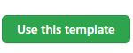
 
 **2. Choose the owner, name, and visibility of the template.**
 
 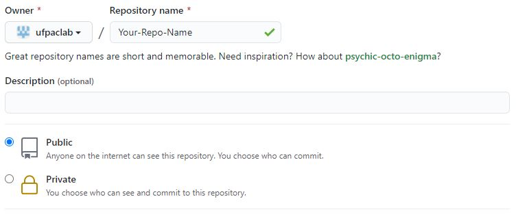
 
 **3. Create the repository.**
 
 

## GitHub Pages
We use Github to host our experiment files. This allows Google Apps Scripts to see and use our experiment files. We need to enable this functionality before we can proceed any further.

**1. Navigate to your new repository.**

**2. Click "Settings".**

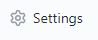

**3. Scroll down until you see *GitHub Pages*.**

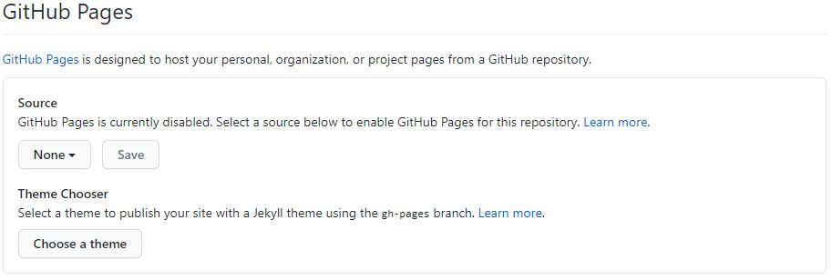

**4. Select a Source (usually *master*).**

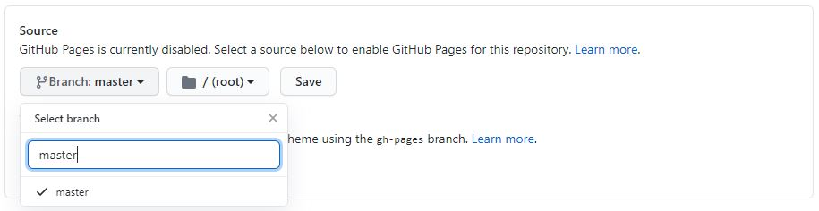

**5. Save.**

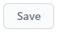

## Update Code
Every repository has it's own url and yours is no different! We need to update this in your code so that the Google Scripts App knows where to look for your files.
**1. Navigate to jsSheet/index.html.**

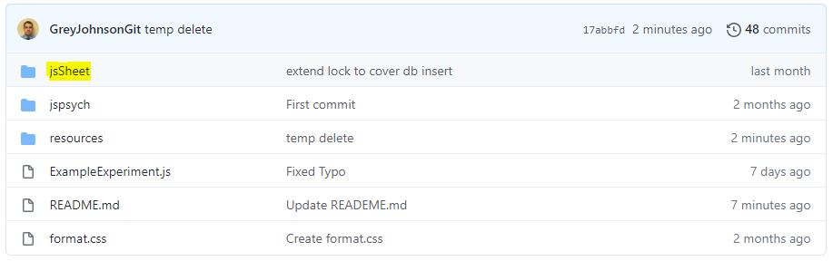

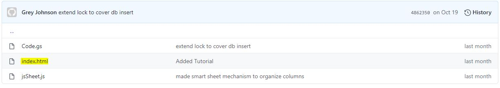

**2. Fill in "https://\<USER\>.github.io/\<REPO\>/" where \<USER\> is your GitHub username and \<REPO\> is the name of your repository. This can also be found near the top of the Github Pages section of your settings.**

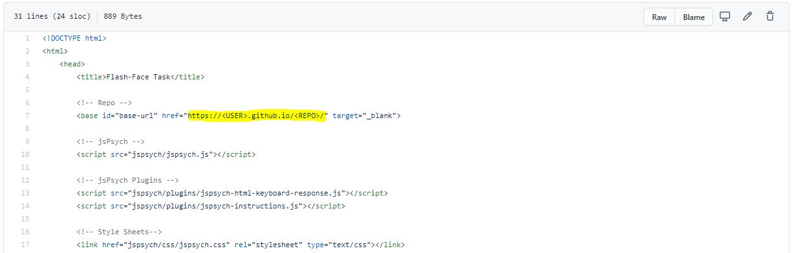

**3. Save your changes and push them to your repository.**

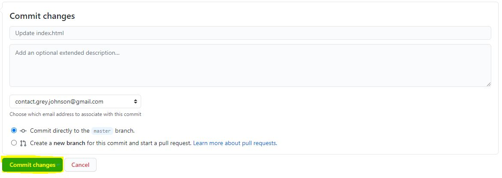

## Deploy to Google Apps
In order to deploy our code to the internet and connect it to our database (Google Sheets), we need to put some of it into a Google App.

**1. Go to your Google Drive**

**2. Create a new Google Sheet**

**3. Go to Tools > Script Editor**

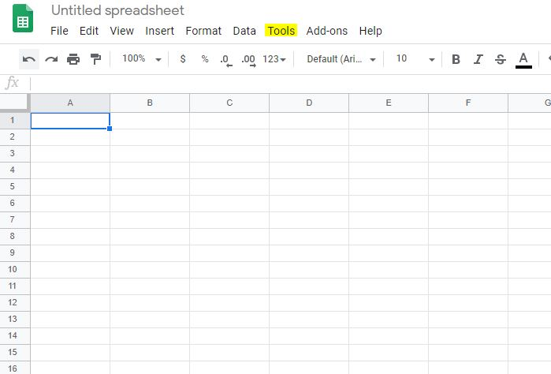

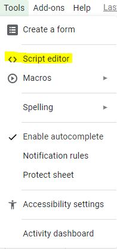

**4. Create a new HTML file by using File > New > HTML File**

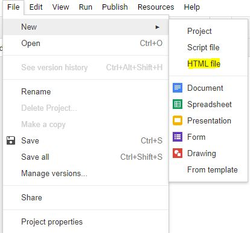

**5. Name it "index"**

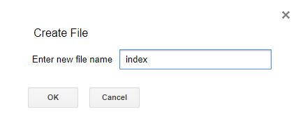

Now, we have two files listed in our App: **Code.gs** and **index.html**. We need to copy the contents of your **Code.gs** and **index.html** into their online versions.

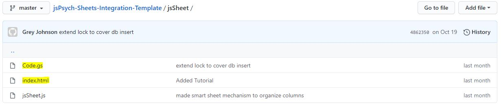

**6. Copy and Save from *jsSheet/index.html* to *index.html* in your Google App.**

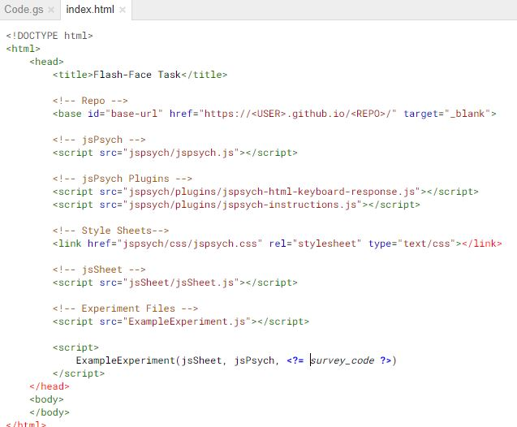

**7. Copy and Save from *jsSheet/Code.gs* to *Code.gs* in your Google App.**

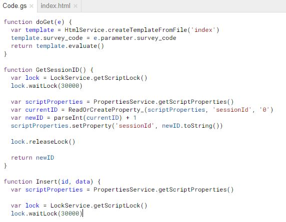

**8. Click Publish > Deploy as Web App**

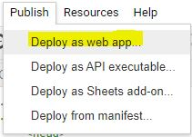

**9. Change the "Who has access to the app:" section to "Anyone, even anonymous"**

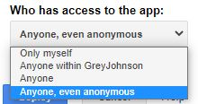

**10. Click Deploy**


Assuming everything has been done correctly, you should be able to access your experiment using the link provided after deploying your experiment. You can now start modifying the index.html and Experiment.js with your jsPsych experiment code. Don't forget to re-upload your index.html to the google app when you make change!

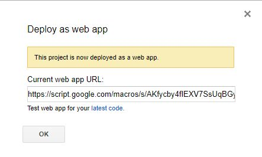

# Credit Granting 
**Important: This tutorial may not work for all credit granters. So far, it has been tested with SONA Systems.**

One of the most valuable qualities of an online study is the ability to run the experiment, get data, and grant credit without any researcher intervention. The most common way to grant credit is to redirect the user to a URL which will automatically give them credit.

Credit granting usually comes in the form of 2 URLs. One URL redirects the user to the online experiment and the other redirects the user back to the credit granting site. Both of the URLs have attached to them a code which can be used to identify the user*. For example, SONA Sytems urls looks like this:

* **To Experiment**: https:/<span>/script.google.com/macros/s/AKfycbxvcjOCRw3q-zwpx3AII4hv19GVKMy1EZt_fuljrK8Mhpm4LHg/exec **?survey_code=12345**
* **Grant Credit**: https:/<span>/ufl.sona-systems.com/webstudy_credit.aspx?experiment_id=123&credit_token=abcdef123456789 **?survey_code=12345**


However, every credit granter has a different system. This means the format of the URL and the type and name of codes can vary greatly. More research needs to be done in order to make this tutorial work with all credit granters.

*note: This value should not be stored permanently. The credit granters system may allow for the user to be identified personally.

## Files

The relevant files to the credit granting system are:

* Code.gs - Grabs the credit code from the URL and passes it into index.html
* index.html - Passes the credit code into the experiment
* Experiment.js - Adds the credit code to the redirect URL and redirects the user on completion.

## How To

The first step is to identify which codes (url parameters) you will need to create your redirect url. We will collect them in Code.gs like so:

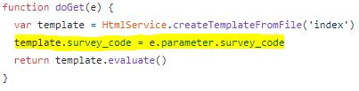

"survey_code" should be replaced with the name of your code. If you have multiple codes, then you can repeat the highlighted snippet as many times as needed with the names of your codes.

Next, we need to set the insertion location in index.html

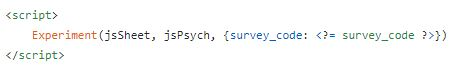

The final parameter of the Experiment function is a Javascript Object. If you only have one code, then simple change "survey_code" to the name of your code. If you have multiple codes, you will need to modify the above snippet like so:
```js
<script>
    Experiment(jsSheet, jsPsych, {
        code1: <?= code1 ?>,
        code2: <?= code2 ?>,
        code3: <?= code3 ?>
    })
</script>
```

These codes will now be available in your Experiment.js file. They are stored in the "data" object and can be accessed like so:

```js
    let oneOfTheCodes = codes.survey_code;
```

Now, we will need to edit your CREDIT_URL. Your credit provider should give you information on how to set up a credit redirect url. Generally it will be in this format:

https://credit-provider-site/abcdef12345/12345?builtInCode=abcdef12345&survey_code=XXXXX

Where XXXXX is the code. Define your own CREDIT_URL using your credit redirect url like so:

```
const CREDIT_URL = `https://credit-provider-site/abcdef12345/12345?builtInCode=abcdef12345&survey_code=${codes.survey_code}`
```

Note that we use string interpolation above. We can place a variable anywhere inside of the `` using \${variable}. We can also access a code using \${codes.survey_code} and place it in the CREDIT_URL.

On an experiment finish, your user should be redirected and granted credit.
